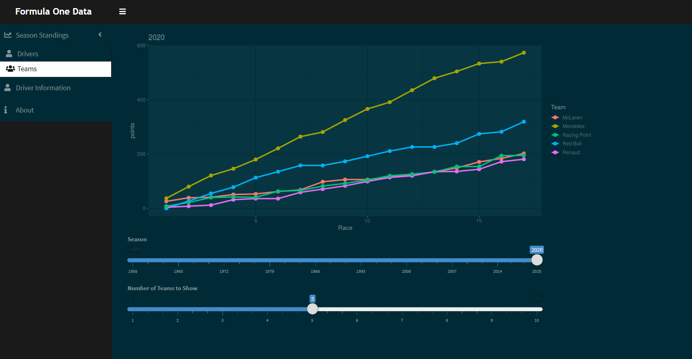

# Formula-1 Shiny App

A Shiny web app fro vizualization of formula one results. Driver or team standings can be compared for a selected season. 

The app can be found at: https://davidtob.shinyapps.io/Formula1/

## Files 

* [app.R](app.R) contains the main script for running the app
* dataPrep.R file for data preparation
* PlotFunction.R script for creating plots

## Data

Data source is ergast.com/mrd

